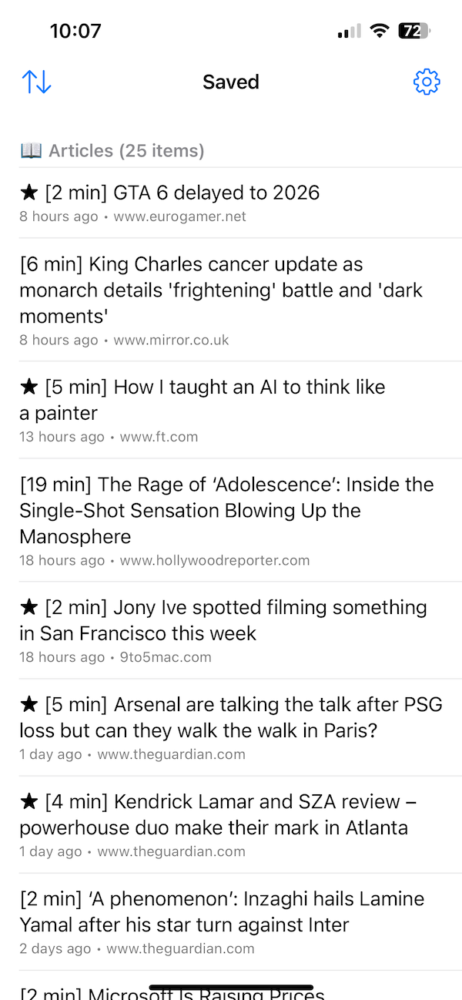
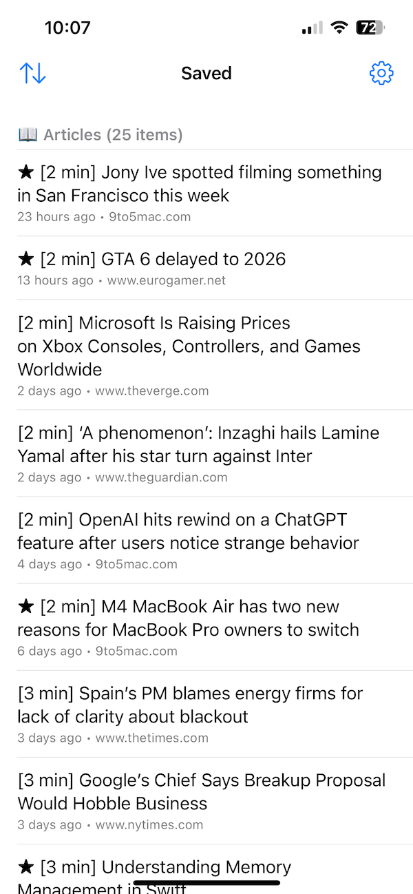
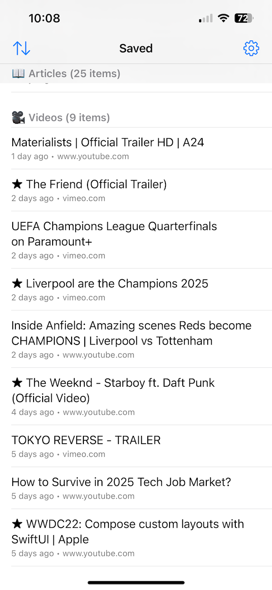
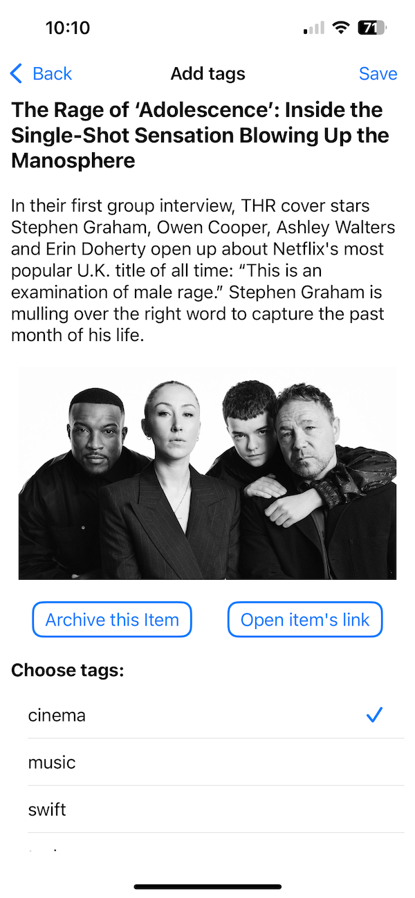
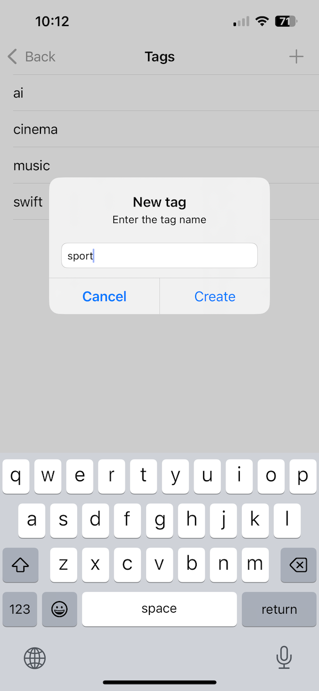

# PocketSorter

iOS app for sorting items saved in Pocket by adding tags or sending to archive.

(An application for managing saved-items chaos. The goal is weekly zero inbox of untagged items.)

## Technologies Used

### Language & UI
- Swift — programming language
- UIKit — user interface framework

### Data Storage
- Core Data — local persistent storage
- NSFetchedResultsController — syncing Core Data with table views
- UserDefaults — lightweight storage for user preferences
- Keychain — secure storage for access tokens

### Networking & Concurrency
- URLSession — network communication with Pocket API
- Async/Await — modern concurrency for asynchronous operations

### UI Infrastructure
- Diffable Data Source — efficient and animated UI updates

## Features

1. Shows list of untagged items added to the Pocket since this Monday
2. Sorts items into sections (articles, videos, other)
3. Shows short information about item (title, excerpt, top image)
4. Allows you to manage items (archive or add tags)
5. Syncs changes with Pocket via API

## Project Architecture

- The app is structured according to the principles of a layered architecture inspired by Clean Architecture.  
- It uses a Coordinator to manage navigation, Repository layers to isolate Core Data access, and encapsulates business logic in dedicated service components (Loader, Service, Manager).  
- Communication between layers is implemented via protocols, delegate patterns, and modern asynchronous code (async/await), ensuring flexibility, testability, and maintainability.  
- Delegates are used to provide reactive feedback from internal logic back to the UI without tight coupling.  
- A State Pattern is implemented using Swift enum`s to declaratively and safely manage UI and data-loading logic based on the current state.

## App Demo

[](Media/demo.gif)

## App Screenshots

### Saved Items

| By Date added | By Time to read | By Type |
|---------------|-----------------|---------|
| [](Media/SavedItemsByDate.PNG) | [](Media/SavedItemsByTime.PNG) | [](Media/SavedItemsArticlesVideos.PNG) |

### Item Details

[](Media/Details.PNG)

### Create Tag

[](Media/CreateTag.PNG)

## Setup

1. Clone the repository.
2. Create a file at `Config/Secrets.xcconfig` with the following content:

```
POCKET_CONSUMER_KEY = your-pocket-consumer-key
POCKET_ACCESS_TOKEN = your-pocket-access-token
```

3. Open `PocketSorter.xcodeproj` in Xcode.
4. Build and run the app.

## Requirements

- iOS 16 or later
- Xcode 14 or later

## License

MIT
