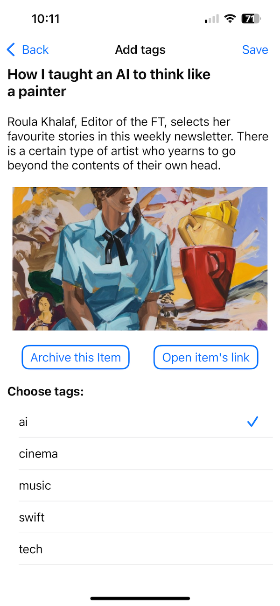

# PocketSorter

iOS app for sorting items saved in Pocket by adding tags or sending to archive.

(An application for managing saved-items chaos. The goal is weekly zero inbox of untagged items.)

## Features

- Shows list of untagged items added to the Pocket since this Monday
- Sorts items into sections (articles, videos, other)
- Shows short information about item (title, excerpt, top image)
- Allows you to manage items (archive or add tags)
- Syncs changes with Pocket via API

## App Demo

[](Media/demo.gif)

## App Screenshots

### Saved Items

| By Date added | By Time to read | By Type |
|---------------|-----------------|---------|
| [](Media/SavedItemsByDate.PNG) | [](Media/SavedItemsByTime.PNG) | [](Media/SavedItemsArticlesVideos.PNG) |

### Item Details

[](Media/Details.PNG)

### Create Tag

[](Media/CreateTag.PNG)

## Setup

1. Clone the repository.
2. Create a file at `Config/Secrets.xcconfig` with the following content:

```
POCKET_CONSUMER_KEY = your-pocket-consumer-key
POCKET_ACCESS_TOKEN = your-pocket-access-token
```

3. Open `PocketSorter.xcodeproj` in Xcode.
4. Build and run the app.

## Requirements

- iOS 16 or later
- Xcode 14 or later

## License

MIT
